# 📚 Trabajo Práctico de Diseño de Sistemas

Hecho con C#, HTML, Bootstrap, Javascript y MySQL. Es
completamente responsive. Fue un trabajo práctico anual, elaborado
con un equipo de 5 personas. Me encargué principalmente del front
end con Razor Pages y Bootstrap, de la parte del Backend con
Entity Framework y MySQL, de la interacción entre la aplicación y
Mercadolibre mediante APIs REST y también estuve involucrado en el
sistema de logins.

### [Consigna](https://github.com/Keiniger/TP-Diseno-de-Sistemas/blob/main/TP-DDS-2020.pdf)

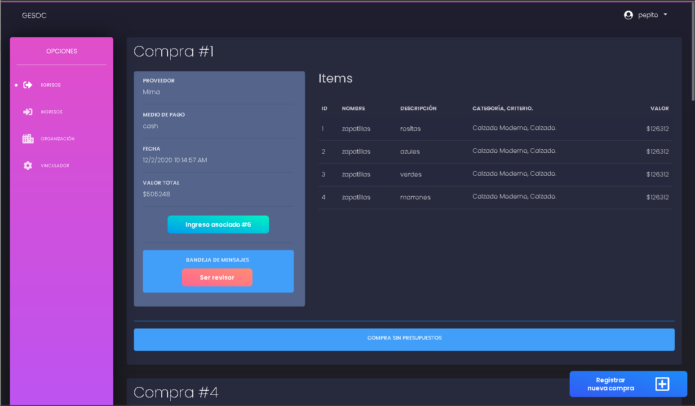

## Gallery
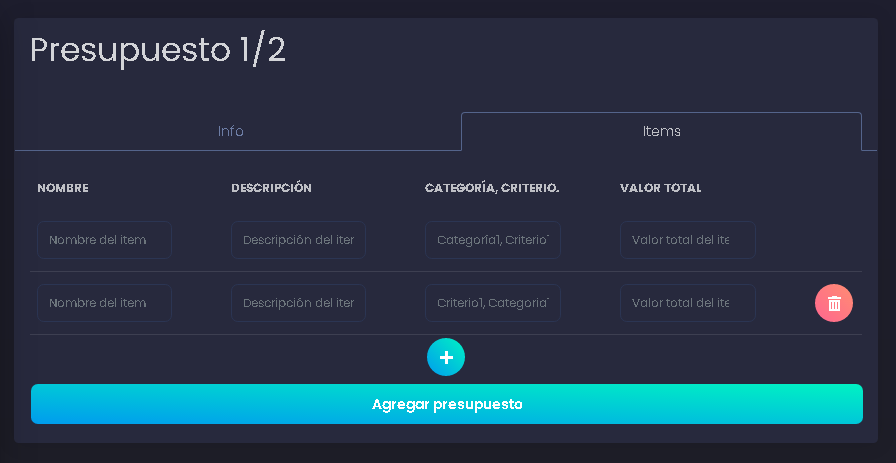
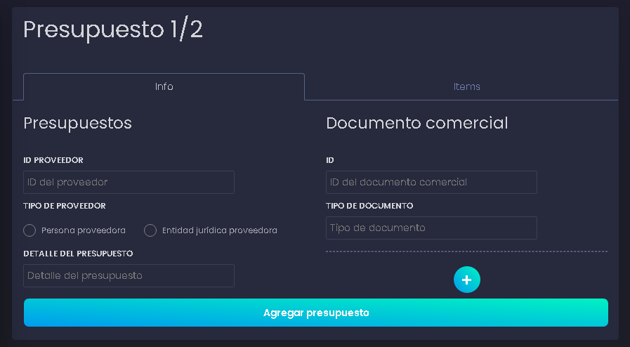
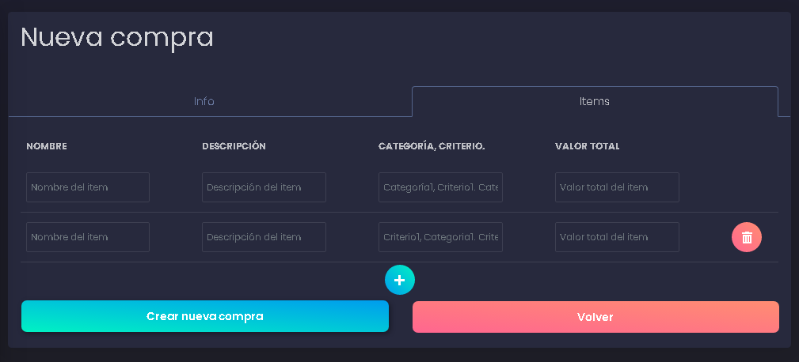
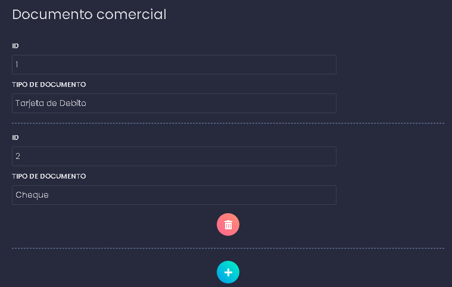
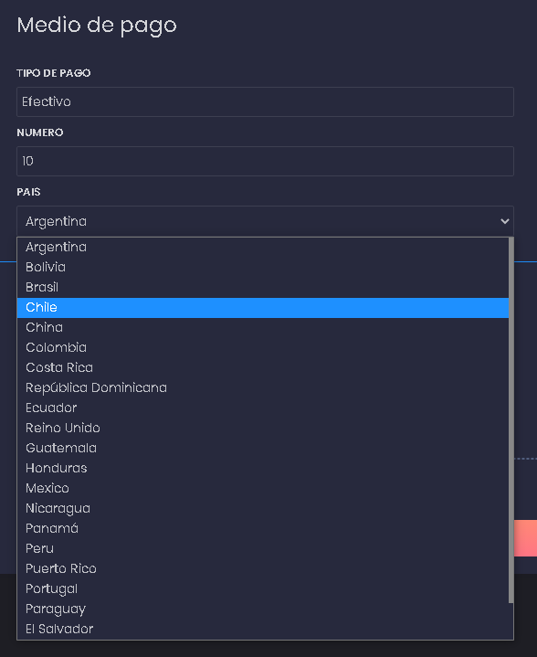
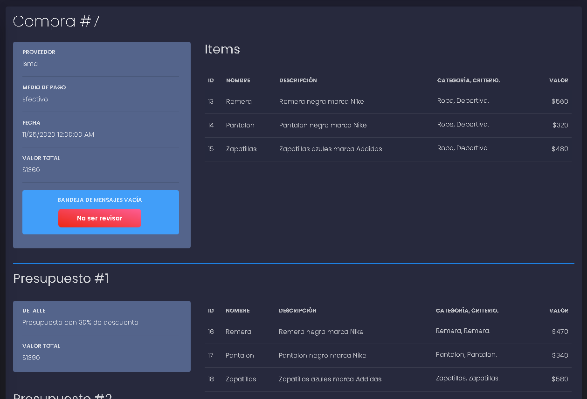
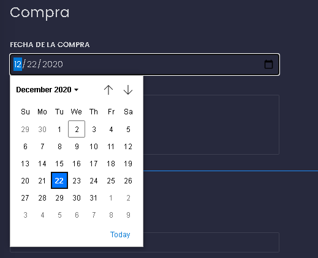
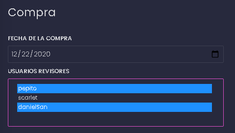
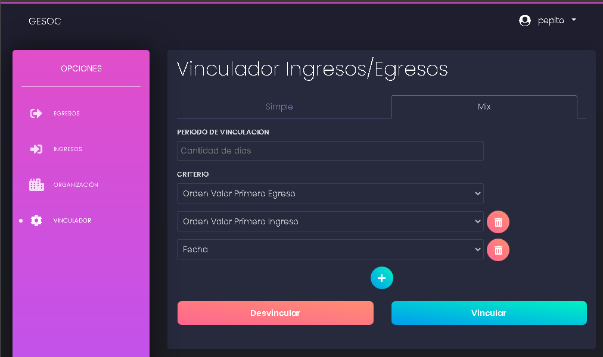
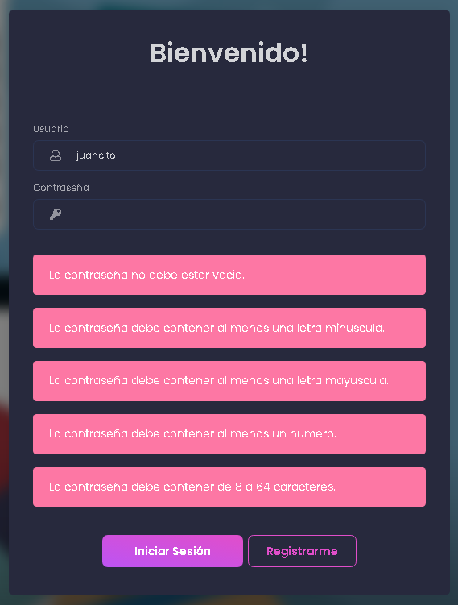
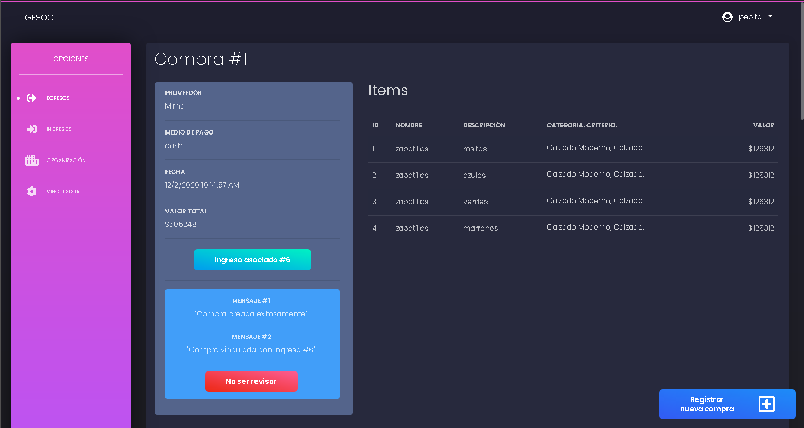
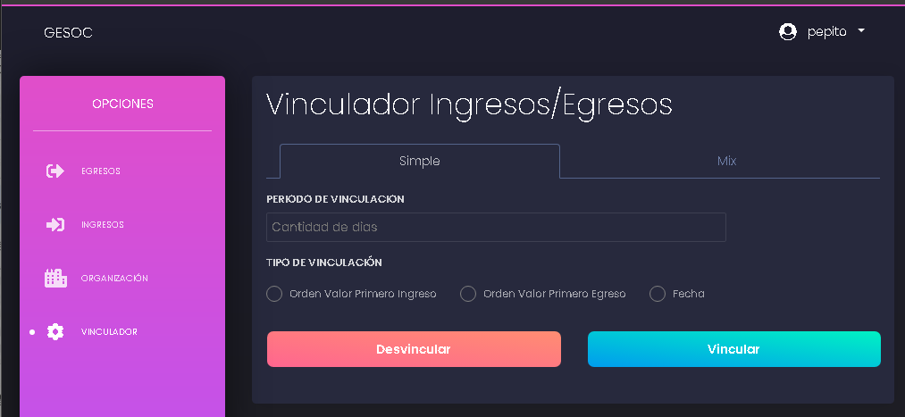
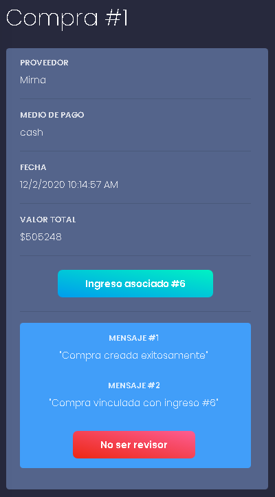
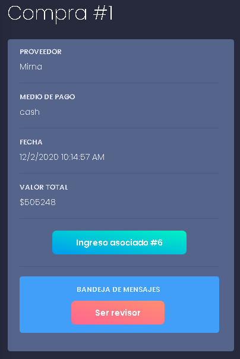
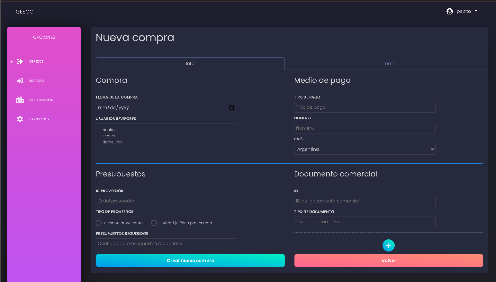
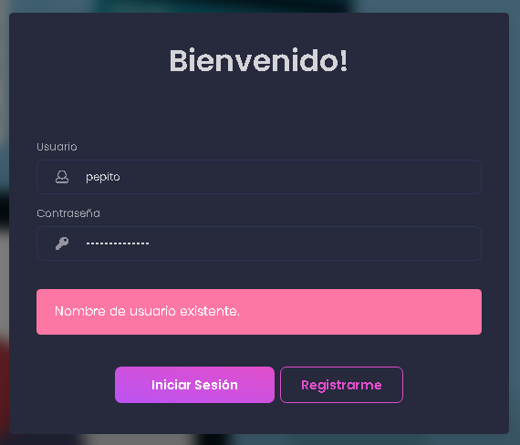
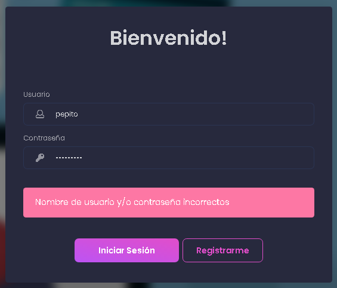
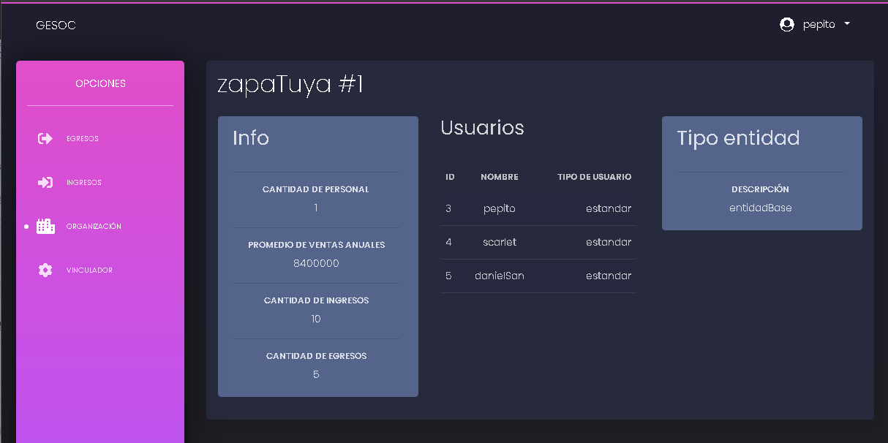
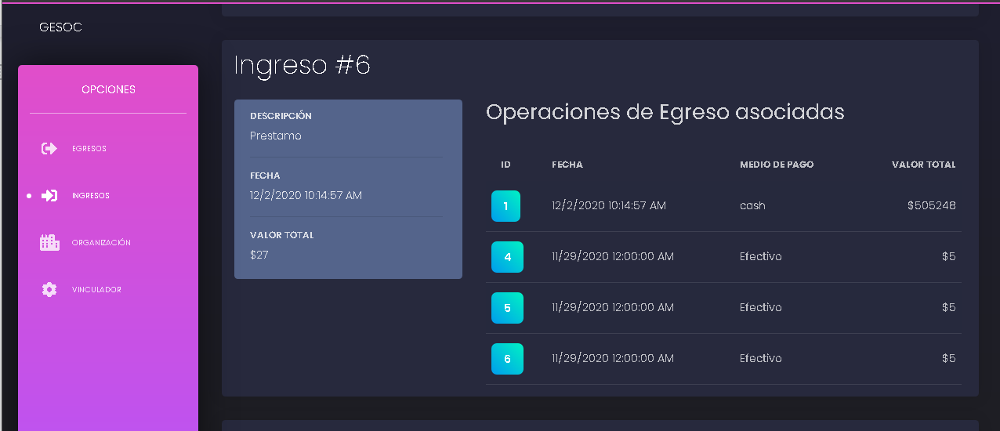

Made by Ignacio Keiniger
